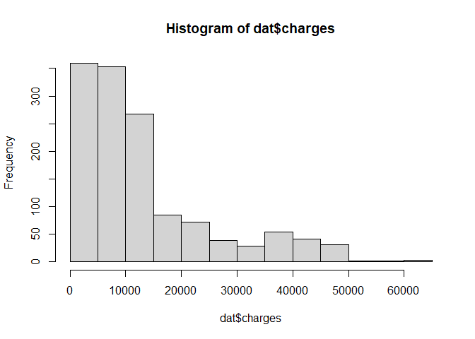
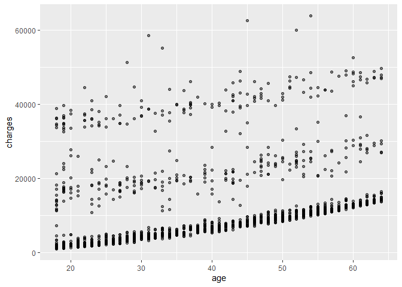
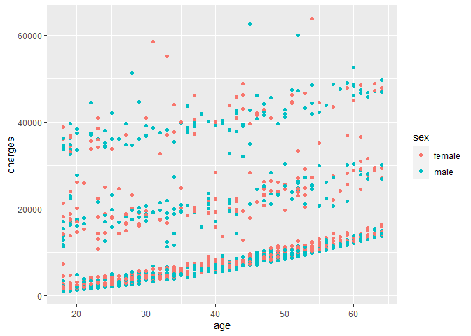
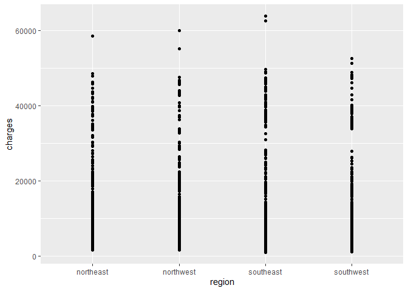
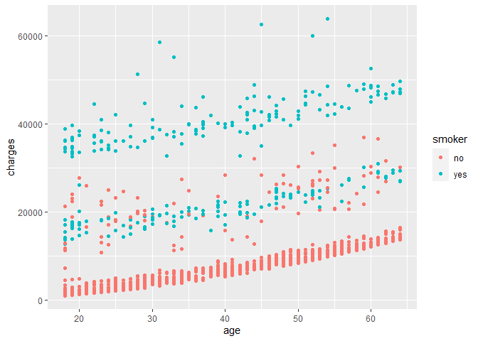
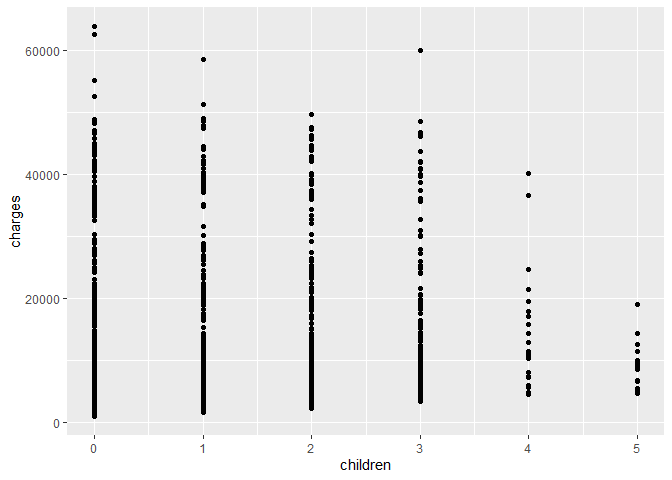
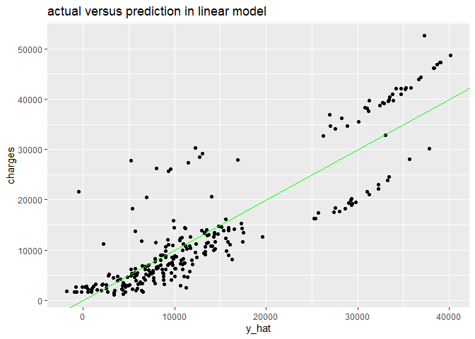
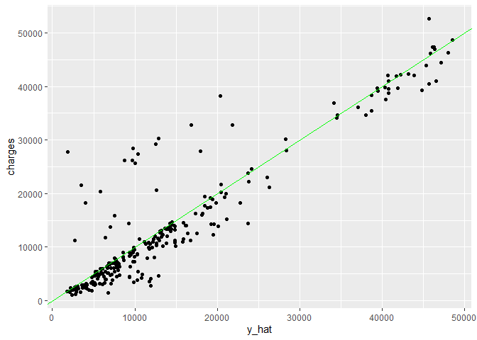

BST260 Final Project Report
================
mian zhao
2022-12-12

# Introduction:

As the pressure of population growth increases, many citizens in
developed countries face health-related issues when they get older. In
Us, health insurance can pay many medical costs, thus many families
would choose to buy medical insurances to prevent tremendous costs if
something unexpected happened.

In this condition, it is necessary to predict the health insurance cost
based on personal background information, which also benefits insurance
companies.

Here we get the dataset from kaggle, with variables age, bmi, gender,
children and region. The outcome is the expenses of health insurance
with some covariates about personal information.

Firstly is to check the class of each covariates in this dataset. Age
and bmi are continuous variables, “sex” “smoke” are binary variables,
and “region”“children” are categorical variables. To better predict
insurance charges, using continuous variables as the major predictor is
appropriate. Thus, We may see if there is a relationship between charges
and age or bmi, and determine the main predictor of insurance charges.
After that, we may determine which model has good fitness in our data.

<!-- --><!-- -->

From the visualization of the data, charges lower than 15000 dollar have
more counts, and ony few people have very high expenses on insurance
(over 60000).There is a linear relationship between charges and age, but
no obvious patterns between charges and bmi. As the age increases, we
can see a trend of increasing charges from the scatterplot. Then, I may
consider to apply linear regression as my first method. To improve the
fitness of my linear regression model, I will also add other covariates
from this dataset in our model to check linear’s least square estimates.
Even though I did not see a significant relationship between charges and
bmi, it may also be needed in a linear model. Finally I will split the
data into training and testing sets to check my linear model’s accuracy.
Meanwhile, to get a more detailed prediction of insurance charges, I
will also apply machine learning algorithms such as random forest to
predict the outcome, and check this algorithm’s performance compared
with the linear model.

# Analyzing：

## method 1:

<!-- --><!-- -->

We generate the training and data dataset to test the performance of our
model. In the linear model, adding one covariate age is obviously not
enough, and I have to select more variables from our data. From the
smoothing line of the ggplot, “Sex”, “region” is independent to
insurance charges. In the plot with sex as binary veriable, the dots
between male and sex is too close, and it is difficulty to determine
gender’s affect on charges. For the covariate region, the distribution
of charges in four region categories are even. Finally I will make
selections excluding these two covariates from our dataset.

<!-- --><!-- -->

In the plot above, it is obvious that green points with “yes smokers”
are throughly above the red points. The binary covariate “smoke”is
required for better fitness in our linear model.

The plot above is about the relationship between children and charges.
As the number of children one person has increases, the average charge
decreases. In the scatter plot, the trend is apparent when the number of
children increases from 3 to 5, and all points are below 20000 when a
person has 5 children.

However, it is hard to determine whether or not bmi is necessary in the
linear, even though people at high bmi show high insurance charges. We
will see the RMSE change with or without bmi.

To test the performance of the linear model, I take 10% of data as test
sets and 90% as training tests. We will generate the model from the
training set.

    ## # A tibble: 5 × 5
    ##   term        estimate std.error statistic   p.value
    ##   <chr>          <dbl>     <dbl>     <dbl>     <dbl>
    ## 1 (Intercept)  -12753.    1069.     -11.9  7.31e- 31
    ## 2 age             250.      13.5     18.6  6.36e- 67
    ## 3 children        596.     156.       3.83 1.38e-  4
    ## 4 smokeryes     23546.     466.      50.6  2.54e-285
    ## 5 bmi             351.      31.2     11.2  9.14e- 28

    ## [1] "The adj square for model 1 is 0.740516517231389"

    ## # A tibble: 4 × 5
    ##   term        estimate std.error statistic   p.value
    ##   <chr>          <dbl>     <dbl>     <dbl>     <dbl>
    ## 1 (Intercept)   -2688.     618.      -4.35 1.48e-  5
    ## 2 age             267.      14.1     18.9  5.51e- 69
    ## 3 children        583.     165.       3.54 4.11e-  4
    ## 4 smokeryes     23525.     492.      47.8  2.66e-267

    ## [1] "The adj square for model 2 is 0.710024388085011"

    ## [1] "The RMSE for model 1 is 5829.74111996821"

    ## [1] "The RMSE for model 2 is 5922.4163776174"

    ##      age children   smoker      bmi 
    ## 1.015554 1.001809 1.000594 1.013276

<!-- -->

The tables shown above are fitted values for two linear models. All
variables in two tables are statistically significant since their
p-values are below 0.05. For the model with bmi, its adj R square is
0.738, RMSE is 5740. For mod2 without bmi, its adj R square is 0.715,
and its RMSE is 6154. The standard to choose the best fitted linear
model is to choose the model with biggest adjusted r square, or the
least RMSE. The results shown above show that the linear model with bmi
is better. I also tested linear model either with addition of sex or
region, and we don’t see increase of adj R square.

I have set age as the main predictor. We can interpret the linear model
as: for one unit increase in age, we expect to see 250 increase in
insurance charges, on average, holding all other covariates constant.
The intercept of this model is -12753.

For this model, I also test the variance inflation factor to determine
whether or not collinearity exists in a linear model, two variables
should not have strong correlations. Collinearity will let our model
mistakenly report adj R square. The result from VIF shows that all
variables in the model show VIF close to one, which means no
collinearity exists(these variables are almost independent with each
other). Then, I also plot the predicted charges versus actual charges in
test sets.

From the plot above, when the charges are below 20000, the prediction is
close to actual charges. However, when the charge gets higher, we see
many points deviate away from the fitted line. Our prediction can either
be too low or too high. Possibly, non-linear effects may exist in our
model, or there is effect modification between different terms. It is
hard to determine that linear is the best one to predict insurance
charges. Therefore, I may take another method to see whether or nor I
can improve my fitness or RMSE.

## Method 2:

The next method is to apply random forest to predict insurance charges.
This algorithm can generate many predictors, each using classification
trees to form a final prediction based on the average prediction of all
these trees. It has randomness and stability. We will use the same
training and test data set to see its performance.

    ## [1] 4797.725

<!-- --> I set
the training control as 6, and take mtry with the least RMSE. All other
settings are default. The output from random forest is better than the
linear model, and we get RMSE about 4282. The plot shown prediction
versus actual value performs much better than the situation in linear
model. At higher units of charges, the predicted value and actual value
are close. The most dots in this model stick to the abline. Even though
a few points at low quantity of charge deviate away from the fitted
line, this model’s performance has made a great improvement. These
points deviating away from the abline may be outliers, and every model
inevitably has certain outliers. Moreover, we don’t see a huge
difference of RMSE between linear model and random forest, which means
our initial approach is correct. Linear model, compared with this
algorithm, is much easier to interpret and understandable to audiences.
We can use the interpretation from the linear model to do predictions of
charges.

# Conclusion:

Based on the analysis above, we concluded that bmi, age, smoking,
children number contributes to the prediction of insurance charges. The
best statistical model is linear regression. In EDA, covariate bmi does
not show specific patterns with charges. However, through the
calculation of RMSE across several linear models, we found that bmi is
required in linear models. The random forest method also shows slightly
lower RMSE compared with the linear.

Overall, our prediction by using a linear model is satisfying. Using a
linear model can catch most of the predictions in the test dataset.
Compared to random forest algorithms, it has low RMSE when the charges
are below 20000. Even though we may see certain outlier-like points in
linear models when the charges are high. The random forest algorithm is
successful since most points between prediction versus actual test value
fit the abline.

If I had more time, I would explore the non-linear effects of covariates
in our linear model, such as age and bmi. Or, I may explore potential
effect modifications or certain combinations of covariates. If those
approaches can decrease the RMSE further more, that means our linear
model still requires improvement.

# References:

<https://www.kaggle.com/datasets/mirichoi0218/insurance>

# Appendix:

``` r
library(tidyverse)

dat<-read_csv("https://raw.githubusercontent.com/stedy/Machine-Learning-with-R-datasets/master/insurance.csv")


hist(dat$charges)


dat |> 
ggplot(aes(age,charges)) + 
geom_point(alpha = 0.5)


dat|>ggplot(aes(age,charges))+geom_point(aes(col=sex))

dat|>ggplot(aes(region,charges))+geom_point()


dat|>ggplot(aes(age,charges))+geom_point(aes(col=smoker))

dat|>ggplot(aes(children,charges))+geom_point()


library(caret)
library(car)

set.seed(2018)

y<-dat$charges
test_index <- createDataPartition(y, times = 1, p = 0.2, list = FALSE)
test_set <- dat[test_index, ]
train_set <- dat[-test_index, ]

lm1<-lm(charges~age+children+smoker+bmi,data=train_set)
lm2<-lm(charges~age+children+smoker,data=train_set)


broom::tidy(lm1)
print(paste("The adj square for model 1 is",summary(lm1)$adj.r.squared))

broom::tidy(lm2)
print(paste("The adj square for model 2 is",summary(lm2)$adj.r.squared))

y_hat<- predict(lm1, test_set)
print(paste("The RMSE for model 1 is",sqrt(mean((y_hat - test_set$charges)^2))))

y_hat1 <- predict(lm2, test_set)
print(paste("The RMSE for model 2 is",sqrt(mean((y_hat1 - test_set$charges)^2))))

vif(lm1)

test_set|> ggplot(aes(x = y_hat, y = charges)) + 
  geom_point() + 
  geom_abline(color = "green")+ggtitle("actual versus prediction in linear model")
library(randomForest)


control <- trainControl(method="cv", number = 6)
train_rf <-  train(charges ~., method = "rf",trControl = control,data=train_set )

fit_rf <- randomForest(charges ~.,
                       mtry = train_rf$bestTune$mtry,data=train_set)

y_hat <- predict(fit_rf,test_set)

RMSE(y_hat, test_set$charges)

test_set|> ggplot(aes(x = y_hat, y = charges)) + 
  geom_point() + 
  geom_abline(color = "green")


labs = knitr::all_labels()
labs = setdiff(labs, c("setup", "get-labels"))
```
